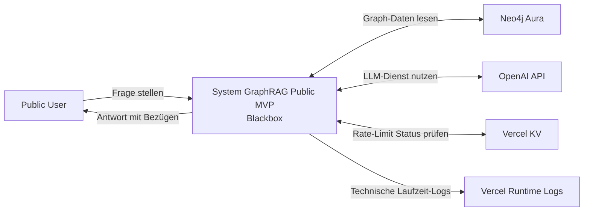
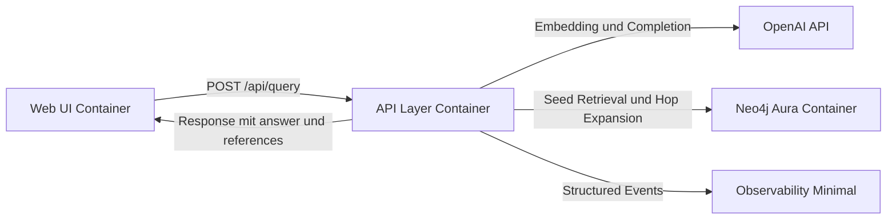
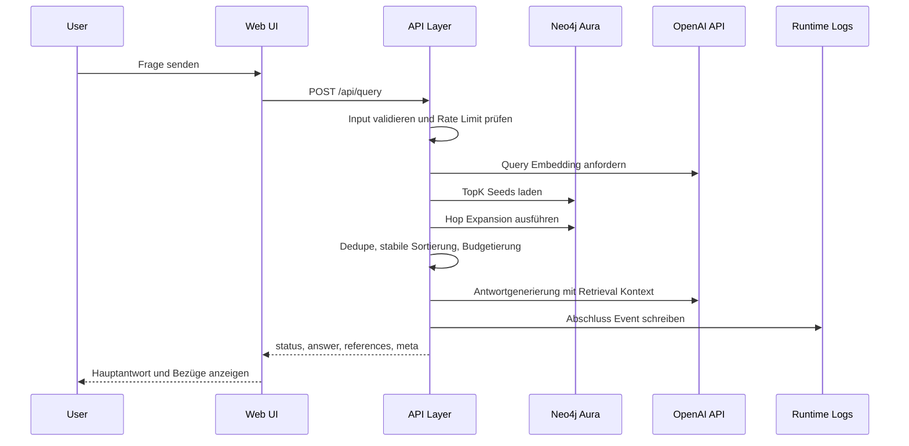

# Arc42 Übersicht Public MVP GraphRAG

## Kontext und Ziel
1. Das System liefert für System Thinking Fragen eine strukturierte Antwort mit nachvollziehbaren Referenzkonzepten.
2. Die Systemgrenze umfasst eine einzelne Next.js Anwendung mit Web UI und API Layer.
3. Externe Systeme sind OpenAI API für Embeddings und Antwortgenerierung, Neo4j Aura für Graph und Vektorindex sowie Vercel als Laufzeit inklusive Vercel KV für Rate Limits.
4. Ziel für MVP ist eine öffentlich erreichbare, testbare und kostenkontrollierte End to End Pipeline ohne Scope Erweiterung.

### Mermaid Kontextdiagramm

## Lösungsstrategie
1. Eine monolithische Laufzeiteinheit auf Next.js reduziert Integrationsaufwand zwischen UI und API.
2. Retrieval läuft kontraktbasiert mit festen Parametern `TopK=6`, `HopDepth=1`, `ContextBudget=1400`.
3. Kontextaufbau ist deterministisch durch feste Sortierung, Dedupe pro `nodeId` und harte Budgetregeln.
4. Antwortaufbau trennt Hauptantwort, Kernnachweis und Referenzen für klare QA Prüfbarkeit.
5. Betriebsfähigkeit wird durch minimale Guardrails abgesichert: Rate Limit, strukturierte Logs, standardisierte Fehlercodes.

## Bausteinsicht Container Ebene
### Web UI
1. Nimmt Query Eingaben an und ruft `POST /api/query` auf.
2. Zeigt Hauptantwort, wichtige Bezüge und Zustände `loading`, `empty`, `error`, `rate_limit`.

### API Layer
1. Implementiert den einzigen MVP Endpoint `POST /api/query` als Next.js Route Handler.
2. Validiert Request Schema und erzwingt Rate Limit vor Retrieval.
3. Führt Retrieval und LLM Aufruf aus und mappt auf das feste Response Schema.
4. Schreibt genau ein strukturiertes Abschluss Log Event pro Request.

### Neo4j Aura
1. Speichert `Concept`, `Author`, `Book`, `Problem` inklusive Relationen.
2. Liefert Vektor Seeds und Hop Expansion gemäß Retrieval Contract.

### OpenAI API
1. Liefert Query Embedding für Seed Suche.
2. Liefert finale Antwortgenerierung auf Basis des strukturierten Retrieval Kontextes.

### Observability Minimal
1. Verwendet Vercel Runtime Logs als einziges MVP Beobachtungsziel.
2. Nutzt feste Pflichtfelder für Betriebssicht und QA Reproduzierbarkeit.

### Mermaid Containerdiagramm

## Laufzeitsicht Query zu Retrieval zu Response
1. Nutzer sendet eine Frage in der Web UI.
2. Web UI ruft `POST /api/query` auf.
3. API Layer validiert Input und prüft Rate Limit.
4. API Layer erzeugt Query Embedding über OpenAI API.
5. API Layer lädt TopK Seeds aus Neo4j Aura und erweitert mit Hop Depth 1.
6. API Layer dedupliziert, sortiert stabil und budgetiert den Kontext.
7. API Layer ruft OpenAI API mit strukturiertem Kontext auf.
8. API Layer liefert strukturierte Antwort inklusive Referenzen und Metadaten.
9. API Layer schreibt ein Abschluss Event mit Status, Latenz und Retrieval Kennzahlen.

### Mermaid Sequenzdiagramm

## Verteilungssicht Deployment
1. Deploy Target ist Vercel für die Next.js Anwendung.
2. Datenhaltung liegt in Neo4j Aura als verwalteter externer Dienst.
3. Quellbasis liegt in GitHub; Secrets werden nur als Runtime Environment Variables gesetzt.
4. Laufzeitmodell ist serverless und stateless pro Request.
5. Detaillierte Deployment Sicht inklusive Netzgrenzen, Guardrails und Rollback liegt in [Deployment View](./deployment-view.md).

## Querschnittliche Konzepte
### Determinismus
1. Sortierung folgt `score DESC`, `hop ASC`, `nodeType ASC`, `nodeId ASC`.
2. Gleiches Input Payload muss bei unverändertem Graph identische Evidenzreihenfolge liefern.
3. Scores werden auf 6 Nachkommastellen gerundet.

### Rate Limit
1. Standardregel ist 10 Requests pro 60 Sekunden je Client IP.
2. Durchsetzung erfolgt serverless konsistent über Vercel KV als Fixed Window Counter.
3. Bei Limitüberschreitung liefert die API `429 RATE_LIMIT`, `Retry-After` und `retryAfterSeconds` mit identischem Wert.
4. Erfolgsantworten liefern verbleibendes Kontingent in `meta.rateLimit`.

### Observability
1. Pro Request genau ein strukturiertes Abschluss Event.
2. Pflichtfelder sind `requestId`, `route`, `method`, `statusCode`, `latencyMs`, `topK`, `hopDepth`, `retrievedNodeCount`, `contextTokens`, `rateLimitTriggered`, `errorCode`.
3. Rohquery Inhalte und Secrets dürfen nicht geloggt werden.

### Fehlerbehandlung
1. Fehlercodes sind `INVALID_REQUEST`, `RATE_LIMIT`, `LLM_UPSTREAM_ERROR`, `GRAPH_BACKEND_UNAVAILABLE`, `UPSTREAM_TIMEOUT`, `INTERNAL_ERROR`.
2. Fehlerantworten folgen einem einheitlichen Schema mit `requestId`, `error.code`, `error.message`, `retryable`.
3. `requestId` wird zusätzlich im Header `X-Request-Id` gespiegelt.

## Architekturentscheidungen mit ADR Referenzen
1. Deployment und Zielplattform sind in [ADR-0001](./adr/adr-0001.md) festgelegt.
2. Retrieval Parameter, Budget und Sortierung sind in [ADR-0002](./adr/adr-0002.md) festgelegt.
3. Tech Stack, API Grenze und minimale Observability sind in [ADR-0003](./adr/adr-0003.md) festgelegt.
4. Serverless konsistentes Rate Limiting ist in [ADR-0004](./adr/adr-0004.md) festgelegt.
5. Diese Arc42 Übersicht konsolidiert die bestehenden Entscheidungen ohne neue Scope Vorgaben.

## Risiken und offene Punkte
1. Ausfall oder erhöhte Latenz von Vercel KV kann API Latenz erhöhen oder zu `500 INTERNAL_ERROR` führen.
2. Die technische Trennregel zwischen `state=empty` und schwacher Evidenz muss in Dev Implementierung exakt festgelegt werden.
3. Modellfixierung und `max_tokens` für Antwortgenerierung sind noch nicht als finale Laufzeitkonfiguration abgeschlossen.
4. Ein verbindliches CI Gate für Konsistenz zwischen `docs/spec/api.md` und `docs/spec/api.openapi.yaml` fehlt noch.
5. `architect.toml` ist im Repository nicht vorhanden, daher erfolgt der Self Check gegen AGENTS und aktuelle Architect Vorgaben.
