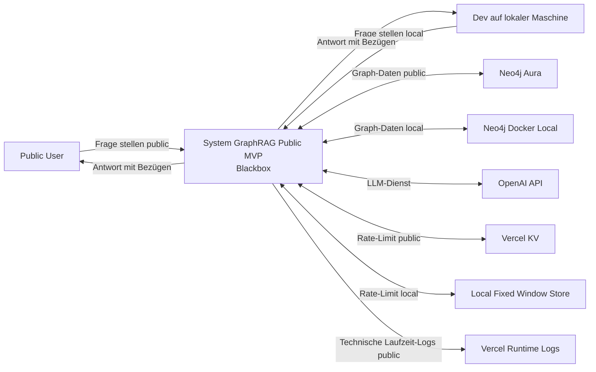
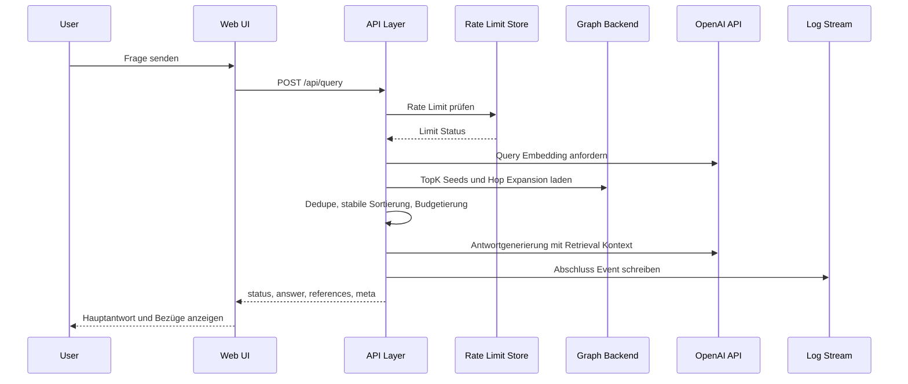

# Arc42 Übersicht Public MVP GraphRAG

## Kontext und Ziel
1. Das System liefert für System Thinking Fragen eine strukturierte Antwort mit nachvollziehbaren Referenzkonzepten.
2. Die Systemgrenze umfasst eine einzelne Next.js Anwendung mit Web UI und API Layer.
3. Public Runtime bleibt unverändert auf Vercel mit Neo4j Aura, OpenAI API und Vercel KV.
4. Local Dev nutzt dieselbe Anwendungsgrenze mit Next.js lokal und Neo4j im Docker Container.
5. Ziel für MVP bleibt eine öffentlich erreichbare, testbare und kostenkontrollierte End to End Pipeline ohne Scope Erweiterung.

### Mermaid Kontextdiagramm


## Lösungsstrategie
1. Eine monolithische Laufzeiteinheit auf Next.js reduziert Integrationsaufwand zwischen UI und API.
2. Tech Stack ist verbindlich auf Next.js `16.1.6` mit TypeScript, Tailwind CSS, shadcn/ui und Atomic Design festgelegt.
3. TypeScript läuft verbindlich mit `strict=true` als MVP Default.
4. Retrieval läuft kontraktbasiert mit festen Parametern `TopK=6`, `HopDepth=1`, `ContextBudget=1400`.
5. Kontextaufbau ist deterministisch durch feste Sortierung, Dedupe pro `nodeId` und harte Budgetregeln.
6. Antwortaufbau trennt Hauptantwort, Kernnachweis und Referenzen für klare QA Prüfbarkeit.
7. Betriebsfähigkeit wird durch minimale Guardrails abgesichert: Rate Limit, strukturierte Logs, standardisierte Fehlercodes.
8. Runtime Unterschiede zwischen `public` und `local` sind explizit dokumentiert, Contracts bleiben identisch.
9. OpenAI Modellwahl ist Environment gesteuert mit Default `gpt-5-mini` ohne Modell Hardcode im Code.

## Laufzeitprofile
### Profil public
1. Hosting erfolgt auf Vercel.
2. Graph Backend ist Neo4j Aura.
3. Rate Limit Store ist Vercel KV.
4. Observability Ziel ist Vercel Runtime Logs.

### Profil local
1. Hosting erfolgt lokal mit Next.js Development Runtime auf `http://localhost:3000`.
2. Graph Backend ist Neo4j Docker auf der lokalen Maschine.
3. Rate Limit Store ist ein prozesslokaler Fixed Window Store.
4. Observability erfolgt lokal strukturiert im Development Log Stream.
5. API Contract, Retrieval Parameter und Fehlercodes sind identisch zum Profil `public`.

## Bausteinsicht Container Ebene
### Web UI
1. Nimmt Query Eingaben an und ruft `POST /api/query` auf.
2. Zeigt Hauptantwort, wichtige Bezüge und Zustände `loading`, `empty`, `error`, `rate_limit`.

### API Layer
1. Implementiert den einzigen MVP Endpoint `POST /api/query` als Next.js Route Handler.
2. Validiert Request Schema und erzwingt Rate Limit vor Retrieval.
3. Führt Retrieval und LLM Aufruf aus und mappt auf das feste Response Schema.
4. Schreibt genau ein strukturiertes Abschluss Log Event pro Request.

### Graph Backend
1. Public Profil nutzt Neo4j Aura.
2. Local Profil nutzt Neo4j Docker mit identischem Datenmodell und Vektorindex Anforderungen.
3. Beide Profile nutzen Node Types `Concept`, `Tool`, `Author`, `Book`, `Problem` und identische Relationstypen.

### OpenAI API
1. Liefert Query Embedding für Seed Suche.
2. Liefert finale Antwortgenerierung auf Basis des strukturierten Retrieval Kontextes.

### Rate Limit Store
1. Public Profil nutzt Vercel KV mit zentralem Fixed Window Counter.
2. Local Profil nutzt prozesslokalen Fixed Window Counter mit denselben Grenzwerten.
3. Contract Verhalten für `429`, `Retry-After` und `retryAfterSeconds` bleibt identisch.

### Observability Minimal
1. Quelle ist der API Layer.
2. Pro Request wird genau ein strukturiertes Abschluss Event geschrieben.
3. Pflichtfelder bleiben in beiden Profilen identisch.

### Mermaid Containerdiagramm
```mermaid
flowchart LR
  web[Web UI Container]
  api[API Layer Container]
  graph[Graph Backend Container]
  openai[OpenAI API]
  kv[Vercel KV public]
  rlLocal[Local Rate Limit Store]
  obs[Observability Minimal]

  web -->|POST /api/query| api
  api -->|Embedding und Completion| openai
  api -->|Seed Retrieval und Hop Expansion| graph
  api -->|Rate-Limit public| kv
  api -->|Rate-Limit local| rlLocal
  api -->|Structured Events| obs
  api -->|Response mit answer und references| web
```

## Laufzeitsicht Query zu Retrieval zu Response
1. Nutzer sendet eine Frage in der Web UI.
2. Web UI ruft `POST /api/query` auf.
3. API Layer validiert Input und prüft Rate Limit über den profilabhängigen Store.
4. API Layer erzeugt Query Embedding über OpenAI API.
5. API Layer lädt TopK Seeds aus dem profilabhängigen Graph Backend und erweitert mit Hop Depth 1.
6. API Layer dedupliziert, sortiert stabil und budgetiert den Kontext.
7. API Layer ruft OpenAI API mit strukturiertem Kontext auf.
8. API Layer liefert strukturierte Antwort inklusive Referenzen und Metadaten.
9. API Layer schreibt ein Abschluss Event mit Status, Latenz und Retrieval Kennzahlen.

### Mermaid Sequenzdiagramm


## Verteilungssicht Deployment
1. Deploy Target für Public Runtime bleibt Vercel für die Next.js Anwendung.
2. Local Dev Topologie ist eine getrennte Betriebsvariante ohne Scope Änderung.
3. Quellbasis liegt in GitHub; Secrets und Keys werden nur als Runtime Environment Variables gesetzt.
4. Local Development nutzt `.env.local` und optional `.env`; beide Dateien werden nicht versioniert.
5. Laufzeitmodell bleibt stateless pro Request.
6. Detaillierte Deployment Sicht inklusive Profiltrennung liegt in [Deployment View](./deployment-view.md).

## Querschnittliche Konzepte
### Determinismus
1. Sortierung folgt `score DESC`, `hop ASC`, `nodeType ASC`, `nodeId ASC`.
2. Gleiches Input Payload muss bei unverändertem Graph identische Evidenzreihenfolge liefern.
3. Scores werden auf 6 Nachkommastellen gerundet.

### Rate Limit
1. Standardregel ist 10 Requests pro 60 Sekunden je Client IP.
2. Public Profil nutzt Vercel KV als Fixed Window Counter.
3. Local Profil nutzt einen prozesslokalen Fixed Window Counter mit denselben Contractwerten.
4. Bei Limitüberschreitung liefert die API `429 RATE_LIMIT`, `Retry-After` und `retryAfterSeconds` mit identischem Wert.
5. Erfolgsantworten liefern verbleibendes Kontingent in `meta.rateLimit`.

### Observability
1. Pro Request genau ein strukturiertes Abschluss Event.
2. Pflichtfelder sind `requestId`, `route`, `method`, `statusCode`, `latencyMs`, `topK`, `hopDepth`, `retrievedNodeCount`, `contextTokens`, `rateLimitTriggered`, `errorCode`.
3. Rohquery Inhalte und Secrets dürfen nicht geloggt werden.

### Fehlerbehandlung
1. Fehlercodes sind `INVALID_REQUEST`, `RATE_LIMIT`, `LLM_UPSTREAM_ERROR`, `GRAPH_BACKEND_UNAVAILABLE`, `UPSTREAM_TIMEOUT`, `INTERNAL_ERROR`.
2. Fehlerantworten folgen einem einheitlichen Schema mit `requestId`, `error.code`, `error.message`, `retryable`.
3. `requestId` wird zusätzlich im Header `X-Request-Id` gespiegelt.

### API State Mapping
1. `state=empty` gilt nur bei `retrievedNodeCount=0` und leerer Referenzliste.
2. `state=answer` gilt bei `retrievedNodeCount>=1` und mindestens einer Referenz.
3. Schwache Evidenz wird nicht als `empty` gemappt.

## Architekturentscheidungen mit ADR Referenzen
1. Deployment und Zielplattform sind in [ADR-0001](./adr/adr-0001.md) festgelegt.
2. Retrieval Parameter, Budget und Sortierung sind in [ADR-0002](./adr/adr-0002.md) festgelegt.
3. Tech Stack, API Grenze und minimale Observability sind in [ADR-0003](./adr/adr-0003.md) festgelegt.
4. Serverless konsistentes Rate Limiting im Public Profil ist in [ADR-0004](./adr/adr-0004.md) festgelegt.
5. Local Development Topologie mit Profiltrennung ist in [ADR-0005](./adr/adr-0005.md) festgelegt.
6. Diese Arc42 Übersicht konsolidiert die bestehenden Entscheidungen ohne neue Scope Vorgaben.

## Risiken und offene Punkte
1. Paritätsabweichungen zwischen Neo4j Docker local und Neo4j Aura public können Retrieval Unterschiede erzeugen.
2. OpenAI API bleibt externe Abhängigkeit für End to End Antwortgenerierung.
3. Ein verbindliches CI Gate für Konsistenz zwischen `docs/spec/api.md` und `docs/spec/api.openapi.yaml` fehlt noch.
