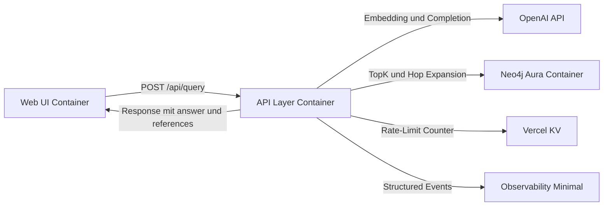
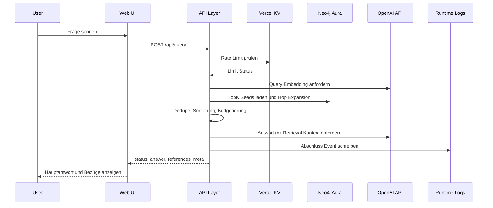

# C4 Container Public MVP GraphRAG

## Containerübersicht
1. Web UI Container als Next.js Frontend auf Vercel.
2. API Layer Container als Next.js Route Handler auf Vercel.
3. Neo4j Aura Container als verwaltete Graph Datenbank.
4. Vercel KV Container als verteilte Rate Limit Ablage.
5. Observability Minimal als strukturierte Vercel Runtime Logs.

## Tech Stack und Lauforte
1. Monorepo Deployable: eine Next.js Anwendung für UI und API Layer.
2. Web Stack: Next.js `16.1.6` App Router mit React, Tailwind CSS und shadcn/ui.
3. UI Architekturpattern: Atomic Design.
4. API Stack: Next.js Route Handler `app/api/query/route.ts` ohne separaten API Service.
5. Runtime: Vercel Node.js Runtime für den Route Handler.
6. Graph Connector: Neo4j Driver gegen Neo4j Aura mit Vektorindex und Graph Queries.
7. LLM Connector: OpenAI API für Embeddings und Antwortgenerierung.
8. Rate Limit Stack: Vercel KV als zentraler Fixed Window Counter.
9. Logging Stack: `console` als strukturierte JSON Events in Vercel Runtime Logs.

## Containerdetails
### Web UI
1. Sendet `POST /api/query` an den API Layer.
2. Zeigt Hauptantwort, wichtige Bezüge und Kernnachweis.
3. Zeigt Zustände Loading, Empty, Error und Rate Limit inline im Antwortbereich.

### API Layer
1. Läuft im selben Next.js Projekt wie die Web UI.
2. Wird als Route Handler für `POST /api/query` implementiert.
3. Läuft serverseitig in Vercel als stateless Runtime.
4. Validiert Request Input und erzwingt Rate Limit.
5. Führt Retrieval Pipeline nach Contract aus.
6. Formatiert den LLM Kontext deterministisch.
7. Ruft OpenAI API auf und mapped Ergebnis in Response Schema.
8. Schreibt minimale Observability Felder in strukturierte Logs.

### Neo4j Aura
1. Hält Node Types `Concept`, `Author`, `Book`, `Problem`.
2. Hält Relationskanten laut Datenmodell.
3. Liefert TopK Seeds über Vektorindex und Nachbarschaften für Hop Expansion.

### Vercel KV
1. Hält instanzübergreifende Rate Limit Counter pro Zeitfenster.
2. Unterstützt atomare Counter Operationen für konsistente `429` Entscheidungen.

### Observability Minimal
1. Quelle ist der API Layer.
2. Persistenz erfolgt über Vercel Runtime Log Stream.
3. Jeder Request erzeugt genau ein Abschluss Event.
4. Felder sind `requestId`, `route`, `method`, `statusCode`, `latencyMs`, `topK`, `hopDepth`, `retrievedNodeCount`, `contextTokens`, `rateLimitTriggered`, `errorCode`.
5. Rohqueries und Secrets dürfen nicht geloggt werden.

## Mermaid Containerdiagramm

## Mermaid Sequenz Query bis Response

## Datenfluss Query zu Retrieval zu Response
1. Web UI sendet `POST /api/query` mit Query Text.
2. API Layer validiert Input und prüft Rate Limit über Vercel KV.
3. API Layer erzeugt Query Embedding über OpenAI API.
4. API Layer liest TopK Seeds aus Neo4j Aura.
5. API Layer erweitert Seeds mit Hop Depth Regeln.
6. API Layer dedupliziert, sortiert stabil und budgetiert den Kontext.
7. API Layer ruft OpenAI API mit strukturiertem Kontext auf.
8. API Layer sendet Antwortobjekt mit Referenzen und Metadaten an Web UI.
9. API Layer schreibt ein strukturiertes Abschluss Event in Vercel Runtime Logs.
