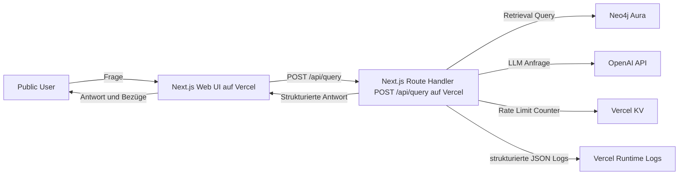

# C4 Kontext Public MVP GraphRAG

## Systemgrenze
1. Das System ist eine öffentlich erreichbare Demo für System Thinking Fragen.
2. Innerhalb der Grenze liegt eine einzelne Next.js Applikation mit Web UI und API Layer im selben Deployable.
3. Die API Grenze liegt im Next.js Route Handler `POST /api/query`.
4. Außerhalb der Grenze liegen LLM Inferenz und Graph Datenhaltung.

## Akteure
1. Public User stellt eine Frage und bewertet Hauptantwort, wichtige Bezüge und Kernnachweis.
2. Dev Team implementiert den API Contract, den Retrieval Contract und die Betriebs Guardrails.
3. QA Team prüft deterministisches Retrieval, API Fehlercodes und Mindestqualität der Antwortstruktur.

## Externe Systeme
1. OpenAI API liefert Query Embeddings und Antwortgenerierung.
2. Neo4j Aura hält den Wissensgraphen und den Vektorindex.
3. Vercel hostet die Next.js Laufzeit für Web UI und Route Handler.
4. Vercel KV hält den verteilten Rate Limit Counter.

## Mermaid Kontextdiagramm

## Kontextfluss
1. Public User sendet eine Frage an die Web UI.
2. Web UI sendet die Frage an den Next.js Route Handler `POST /api/query`.
3. API Layer prüft das Rate Limit über Vercel KV.
4. API Layer fragt Neo4j Aura für Seed Retrieval und Graph Expansion ab.
5. API Layer baut einen budgetierten Kontext und ruft OpenAI API auf.
6. API Layer liefert strukturierte Antwortdaten zurück an die Web UI.
7. Route Handler schreibt minimale, strukturierte Telemetrie in Vercel Runtime Logs.
