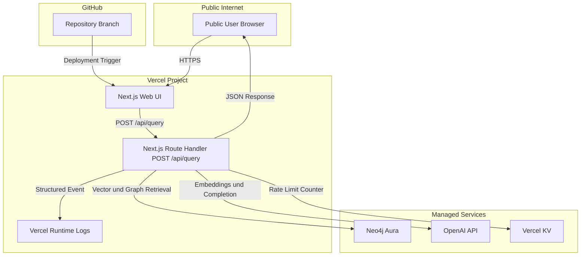
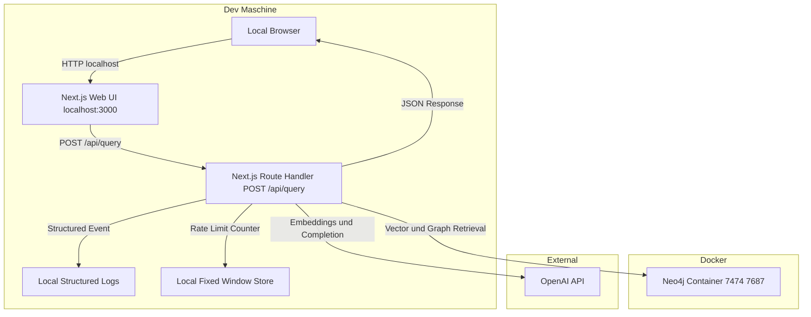

# Deployment View Public MVP GraphRAG

## Ziel und Abgrenzung
1. Dieses Artefakt beschreibt die Deployment Sicht der bestehenden MVP Architektur.
2. Public Runtime Ziel bleibt unverändert: Vercel plus Neo4j Aura.
3. Local Dev Topologie wird als getrenntes Laufzeitprofil dokumentiert, ohne Scope Änderung oder neue Produktfeatures.

## Laufzeitprofile
### Profil public
1. Hosting und Runtime liegen auf Vercel.
2. Graph Backend ist Neo4j Aura.
3. Rate Limit Store ist Vercel KV.
4. Ziel ist öffentlich erreichbare Demo Laufzeit.

### Profil local
1. Hosting und Runtime liegen lokal auf der Dev Maschine mit Next.js.
2. Graph Backend ist Neo4j im Docker Container.
3. Rate Limit Store ist ein prozesslokaler Fixed Window Store.
4. Ziel ist reproduzierbare lokale Entwicklung ohne Abhängigkeit von Vercel Runtime und Neo4j Aura.

## Tech Stack Bindung
1. Laufzeiteinheit bleibt eine Next.js `16.1.6` Anwendung mit TypeScript, Web UI und API Layer.
2. UI Stack bleibt auf Tailwind CSS und shadcn/ui festgelegt.
3. UI Architekturpattern bleibt Atomic Design.
4. API Grenze bleibt der Route Handler `POST /api/query` ohne separaten Service.
5. TypeScript Compiler Strictness bleibt verbindlich auf `strict=true`.

## Lauforte und Verantwortungen
### Public Client Runtime
1. Läuft im Browser des Public Users.
2. Nutzt ausschließlich HTTPS Aufrufe an die Next.js Anwendung.
3. Hat keinen direkten Zugriff auf Neo4j Aura oder OpenAI API.

### Local Client Runtime
1. Läuft im Browser auf der Dev Maschine.
2. Ruft dieselbe API Route `POST /api/query` über `http://localhost:3000` auf.
3. Hat keinen direkten Zugriff auf Neo4j oder OpenAI API.

### Next.js Runtime
1. Public Profil: Next.js läuft auf Vercel.
2. Local Profil: Next.js läuft lokal als Development Runtime.
3. In beiden Profilen bleibt der API Contract identisch.

### Graph Backend
1. Public Profil: Neo4j Aura.
2. Local Profil: Neo4j Docker mit lokalem Bolt Endpoint `bolt://localhost:7687` und Browser Endpoint `http://localhost:7474`.
3. Datenmodell, Constraints und Vektorindex Anforderungen sind in beiden Profilen gleich.

### Rate Limit Store
1. Public Profil: zentraler Vercel KV Fixed Window Counter.
2. Local Profil: prozesslokaler Fixed Window Counter mit identischen Contractparametern.
3. Response Verhalten bei `429` bleibt in beiden Profilen identisch.

### Source und Delivery
1. GitHub ist die Quellbasis.
2. Vercel erstellt Public Deployments aus dem verbundenen Repository.
3. Local Profil wird direkt aus dem Workspace gestartet.

## Unterschiede Local Dev und Public Runtime
1. Hosting Ort: `local` auf Dev Maschine, `public` auf Vercel.
2. Graph Backend: `local` Docker Neo4j, `public` Neo4j Aura.
3. Rate Limit Speicher: `local` prozesslokal, `public` Vercel KV.
4. Observability Ziel: `local` lokaler Log Stream, `public` Vercel Runtime Logs.
5. API Surface, Retrieval Contract, Fehlercodes und Response Schema bleiben identisch.

## Environment Profiles
### Gemeinsame Pflichtvariablen
1. `OPENAI_API_KEY`
2. `OPENAI_MODEL`
3. `NEO4J_URI`
4. `NEO4J_USERNAME`
5. `NEO4J_PASSWORD`
6. `RATE_LIMIT_MAX_REQUESTS`
7. `RATE_LIMIT_WINDOW_SECONDS`
8. `RATE_LIMIT_IP_SALT`
9. Defaultwert für `OPENAI_MODEL` ist `gpt-5-mini` und wird in Environment Konfiguration gesetzt.
10. Im Anwendungscode ist kein hartkodierter Modellname zulässig.

### Public Profil zusätzliche Variablen
1. `KV_REST_API_URL`
2. `KV_REST_API_TOKEN`

### Local Profil Vorgaben
1. `NEO4J_URI` zeigt auf `bolt://localhost:7687`.
2. `NEO4J_USERNAME` und `NEO4J_PASSWORD` stammen aus lokalem Docker Neo4j Setup.
3. Keine Abhängigkeit von `KV_REST_API_URL` und `KV_REST_API_TOKEN`.
4. `RATE_LIMIT_MAX_REQUESTS` und `RATE_LIMIT_WINDOW_SECONDS` bleiben auf denselben Werten wie public.
5. Variablen werden lokal aus `.env.local` geladen, optional aus `.env` als Fallback.
6. `.env` und `.env.local` werden nicht versioniert und nicht im Repository geteilt.
7. `OPENAI_MODEL` wird lokal explizit gesetzt und auf `gpt-5-mini` vorbelegt.
8. `NEO4J_DOCKER_IMAGE` wird lokal auf `neo4j:5.26.0` gepinnt.

## Deterministische Reproduzierbarkeit local
1. Portbelegung ist fest: Next.js `3000`, Neo4j HTTP `7474`, Neo4j Bolt `7687`.
2. Docker Neo4j läuft als dedizierter lokaler Container mit persistentem Volume.
3. Lokale Graphdatenbasis folgt identischem Datenmodell wie `docs/architecture/data-model.md`.
4. Lokale Rate Limit Grenzen sind identisch zu public: `10` pro `60` Sekunden.
5. Abweichungen vom Local Profil müssen als ADR oder Handoff Update dokumentiert werden.
6. Für lokale Starts ist ausschließlich das gepinnte Image `neo4j:5.26.0` zulässig.

## Netz und Security Guardrails MVP
1. Transport erfolgt über TLS im Public Profil.
2. Local Profil bleibt auf localhost Kommunikation begrenzt.
3. Secrets und Keys werden nur als Runtime Environment Variables gesetzt.
4. Local Secrets und Keys liegen in `.env.local` oder `.env`, Public Secrets und Keys in Vercel Environment Variables.
5. `.env` und `.env.local` werden nie im Repository gespeichert.
6. OpenAI API Key wird als separater Key mit Usage Limit betrieben.
7. Logs enthalten keine Rohquery Inhalte und keine Secrets.
8. Externe Abhängigkeiten im Public Profil bleiben auf Neo4j Aura, OpenAI API und Vercel KV begrenzt.

## Deploy und Startablauf
### Public Deploy Ablauf
1. Änderungen werden in GitHub auf den produktiven Branch gemerged.
2. Vercel baut und deployt die Next.js Anwendung als neues Deployment.
3. Runtime Environment Variables werden pro Vercel Environment bereitgestellt.
4. Nach Deploy wird ein Smoke Test über `POST /api/query` gegen die Public URL ausgeführt.

### Local Startablauf
1. Neo4j Docker Image `neo4j:5.26.0` verwenden und Container starten, danach Erreichbarkeit auf Port `7687` prüfen.
2. Local Environment Profil über `.env.local` setzen, optional mit `.env` als Fallback.
3. Next.js lokal starten und Erreichbarkeit von `http://localhost:3000` prüfen.
4. Smoke Test über `POST /api/query` gegen localhost ausführen.
5. Erfolgsziel ist valider Contract Response plus genau ein strukturiertes Abschluss Event pro Request.

## Rollback Hinweise
1. Public Rollback erfolgt durch Promotion des letzten stabilen Vercel Deployments.
2. Environment Variable Änderungen werden beim Public Rollback auf den letzten stabilen Satz zurückgeführt.
3. Local Rollback erfolgt durch Rückkehr auf den letzten stabilen Git Commit und lokalen Neustart.
4. Nach Rollback wird im jeweiligen Profil derselbe Smoke Test erneut ausgeführt.

## Mermaid Deployment Diagramm Public Profil

## Mermaid Deployment Diagramm Local Profil

