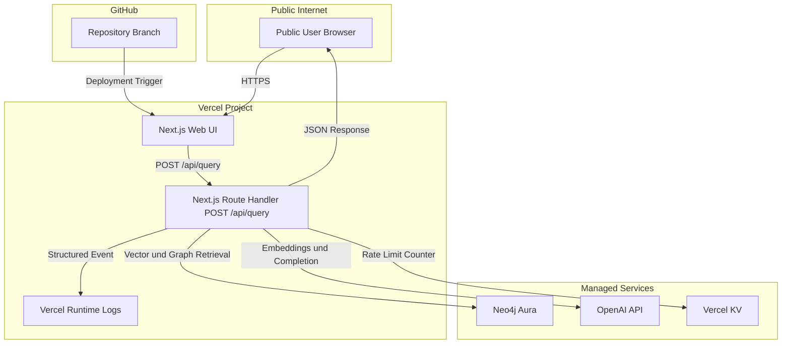

# Deployment View Public MVP GraphRAG

## Ziel und Abgrenzung
1. Dieses Artefakt beschreibt die Deployment Sicht der bestehenden MVP Architektur.
2. Das Dokument ergänzt C4 und Arc42 ohne Scope Änderung oder neue Features.

## Tech Stack Bindung
1. Laufzeiteinheit bleibt eine Next.js `16.1.6` Anwendung mit Web UI und API Layer.
2. UI Stack bleibt auf Tailwind CSS und shadcn/ui festgelegt.
3. UI Architekturpattern bleibt Atomic Design.
4. API Grenze bleibt der Route Handler `POST /api/query` ohne separaten Service.

## Lauforte und Verantwortungen
### Public Client Runtime
1. Läuft im Browser des Public Users.
2. Nutzt ausschließlich HTTPS Aufrufe an die Next.js Anwendung.
3. Hat keinen direkten Zugriff auf Neo4j Aura oder OpenAI API.

### Vercel Runtime
1. Hostet die Next.js Anwendung mit Web UI und Route Handler `POST /api/query`.
2. Führt Retrieval und Antwortgenerierung serverseitig und stateless pro Request aus.
3. Schreibt genau ein strukturiertes Abschluss Event je Request in Vercel Runtime Logs.

### Externe Managed Services
1. Neo4j Aura hostet Wissensgraph und Vektorindex.
2. OpenAI API liefert Embeddings und Antwortgenerierung.
3. Vercel KV hostet den verteilten Rate Limit Counter für `POST /api/query`.
4. Diese Dienste sind externe Laufzeitabhängigkeiten des API Layers.

### Source und Delivery
1. GitHub ist die Quellbasis.
2. Vercel erstellt Deployments aus dem verbundenen Repository.

## Runtime Grenzen und externe Abhängigkeiten
1. Die Systemgrenze endet an der Next.js Anwendung auf Vercel.
2. Inbound Traffic ist auf HTTPS Requests zur Web UI und zu `POST /api/query` begrenzt.
3. Outbound Traffic des API Layers geht nur zu Neo4j Aura, OpenAI API und Vercel KV.
4. Browser Requests gehen nie direkt an Neo4j Aura oder OpenAI API.
5. Neo4j Ausfälle werden als `503 GRAPH_BACKEND_UNAVAILABLE` behandelt.
6. OpenAI Ausfälle werden als `502 LLM_UPSTREAM_ERROR` oder `504 UPSTREAM_TIMEOUT` behandelt.

## Environment Variables
1. `OPENAI_API_KEY`
2. `OPENAI_MODEL`
3. `NEO4J_URI`
4. `NEO4J_USERNAME`
5. `NEO4J_PASSWORD`
6. `RATE_LIMIT_MAX_REQUESTS`
7. `RATE_LIMIT_WINDOW_SECONDS`
8. `KV_REST_API_URL`
9. `KV_REST_API_TOKEN`
10. `RATE_LIMIT_IP_SALT`

## Netz und Security Guardrails MVP
1. Transport erfolgt nur über TLS.
2. Secrets werden nur als Runtime Environment Variables in Vercel gesetzt.
3. Secrets werden nie im Repository gespeichert.
4. OpenAI API Key wird als separater Key mit Usage Limit betrieben.
5. Basis Rate Limit bleibt aktiv mit Standardregel 10 Requests pro 60 Sekunden je Client IP.
6. Rate Limit Schlüssel werden aus gehashter IP gebildet und nicht als Klartext persistiert.
7. Logs enthalten keine Rohquery Inhalte und keine Secrets.
8. Externe Abhängigkeiten bleiben auf Neo4j Aura, OpenAI API und Vercel KV begrenzt.

## Deploy Ablauf
1. Änderungen werden in GitHub auf den produktiven Branch gemerged.
2. Vercel baut und deployt die Next.js Anwendung als neues Deployment.
3. Runtime Environment Variables werden pro Vercel Environment bereitgestellt.
4. Nach Deploy wird ein Smoke Test über `POST /api/query` gegen die Public URL ausgeführt.
5. Erfolgskriterium ist valide API Response plus genau ein strukturiertes Abschluss Event pro Testrequest.

## Rollback Hinweise
1. Rollback erfolgt durch Promotion des letzten stabilen Vercel Deployments.
2. Environment Variable Änderungen werden beim Rollback auf den letzten stabilen Satz zurückgeführt.
3. Datenbankseitig sind destruktive Änderungen im selben Release zu vermeiden, damit Rollback ohne Datenrisiko möglich bleibt.
4. Nach Rollback wird derselbe Smoke Test erneut ausgeführt.

## Mermaid Deployment Diagramm

