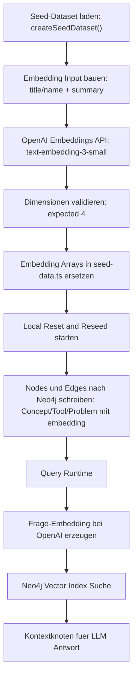

# Seed Embedding Flow

## Ziel
Dieser Ablauf beschreibt den technischen Pfad von Seed-Embedding-Refresh bis zur Retrieval-Nutzung in der Runtime.

## Mermaid Ablauf

## Schritte
1. Embeddings refreshen mit `pnpm --dir apps/web seed:embeddings:refresh`.
2. Das Script ruft `POST /v1/embeddings` auf und schreibt die Vektoren direkt in `apps/web/src/features/seed-data/seed-data.ts`.
3. Seed neu einspielen mit `pnpm --dir apps/web seed:local:reset-reseed`.
4. Die Runtime nutzt bei jeder Frage ein Query-Embedding und sucht damit im Neo4j-Vector-Index.

## Relevante Dateien
1. `apps/web/scripts/refresh-seed-embeddings.ts`
2. `apps/web/src/features/seed-data/seed-data.ts`
3. `apps/web/src/features/seed-data/local-seed-reset.ts`
4. `apps/web/src/features/query/retrieval.ts`
